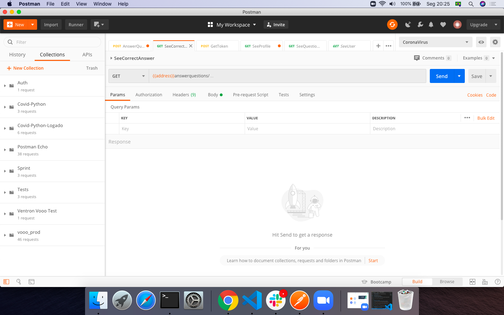
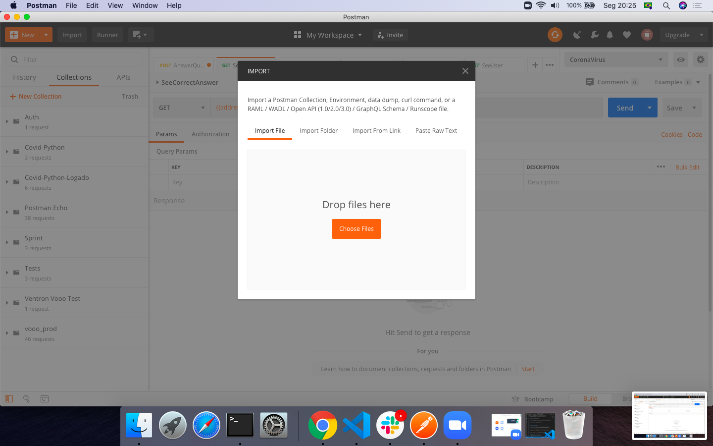
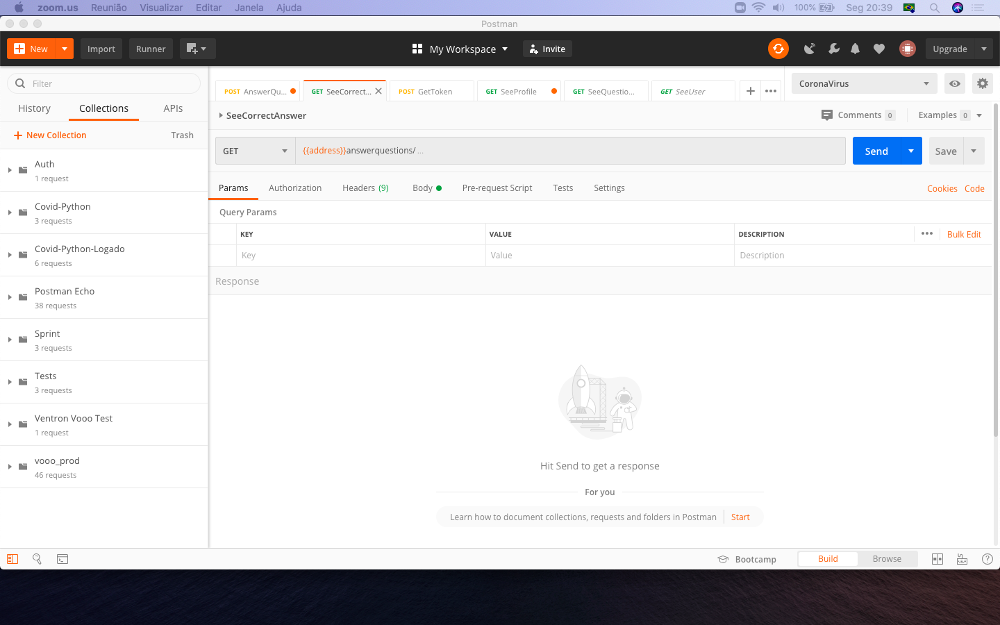
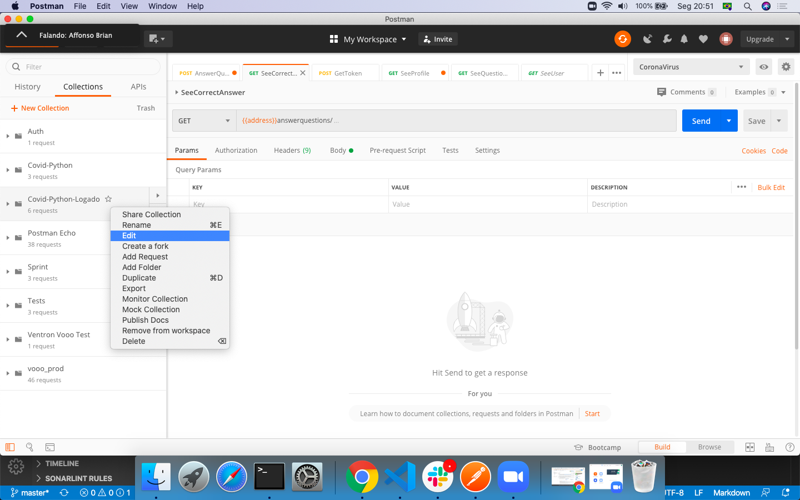
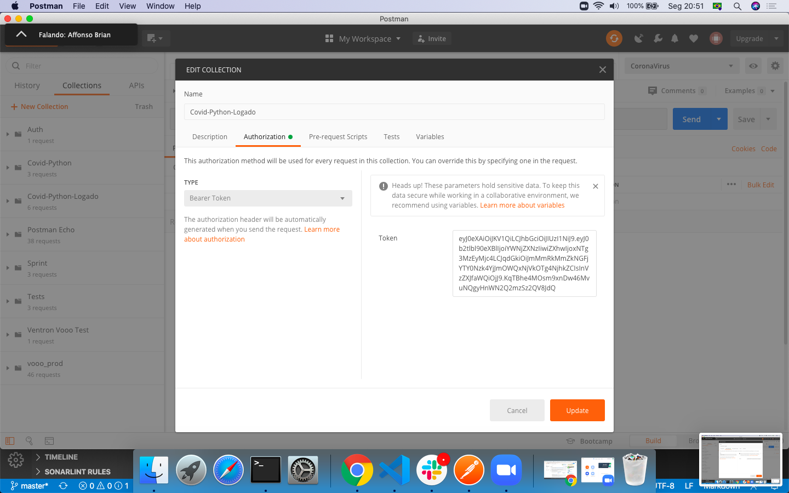
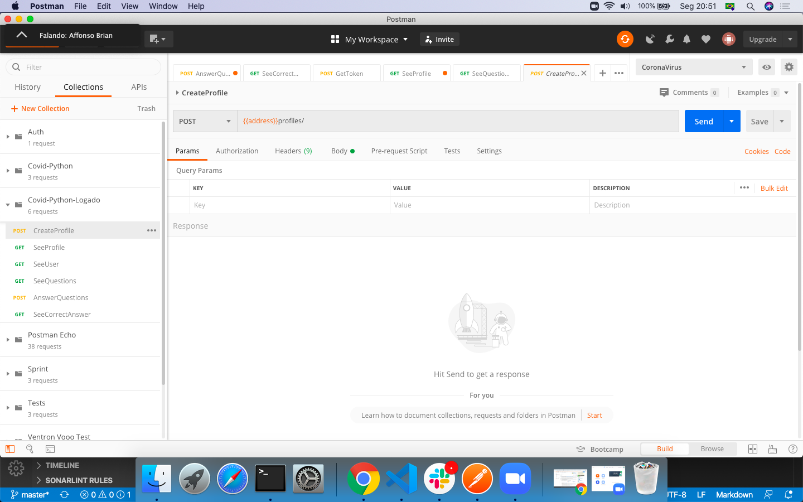
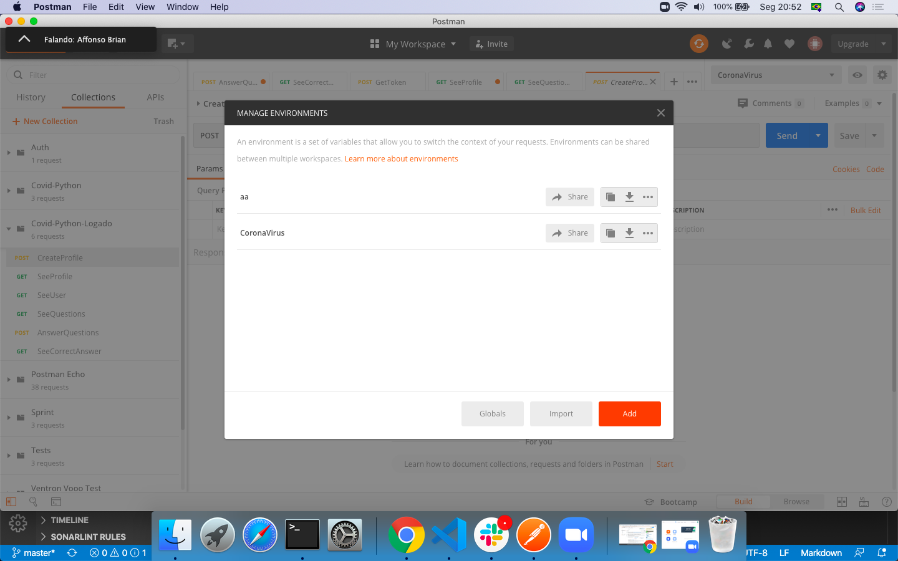
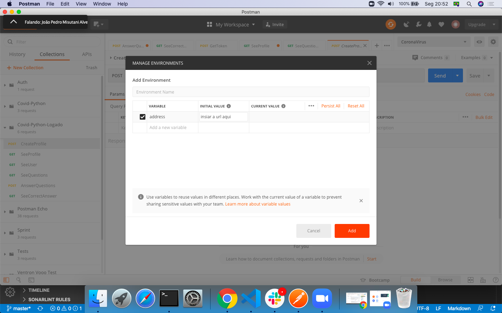

# CoronaVirusBackend (ALPHA)
## Aplicação em Python para servir ao aplicativo do Corona Virus

## Onde acessar a API?
https://coronasavior.herokuapp.com/

## Como acessar o Painel de Administrador?
1 - Acesse pelo navegador o endereço: https://coronasavior.herokuapp.com/admin/

2 - Insira o usuario e senha de administrador

## Como fazer as requisições?
### Os passos a seguir podem ser feitos pelo postman ou pelo navegador.

1 - De um POST no seguinte endereço https://coronasavior.herokuapp.com/ e informe: `first_name`, `last_name`, `username`, `email_address` and `password`.

2 - De um POST no endereço https://coronasavior.herokuapp.com/api/token/ e informe: `username` e `password`.

3 - Pegue o atributo `access` retornado no passo anterior.

### Os passos a seguir podem necessitam do Postman configurado (tutorial na próxima sessão)
1 - Pegue as collections disponibilizadas

2 - Utilize 😃

## Como configurar o Postman?
Existem dois arquivos de collections, um para os endpoints que não necessitam de autenticação e outro que necessita.

O arquivo que não necessita de autenticação realiza as tarefas descritas no passo `Como fazer requisições`.

O segundo arquivo por sua vez permite a utilização da API em si, entretanto precisamos configura-lo no postman. Para isso siga o passo a passo a seguir.

### 1 - Abra o Postman e clique em `import` no canto superior esquerdo.




### 2 - Selecione o arquivo `Covid-Python-Logado.postman_collection.json`



### 3 - Após importar ele aparecerá no canto esquerdo




### 4 - Clique com o botão direito sobre a collection e em seguida `editar`




### 5 - Na aba de autorização selecione o tipo `Bearer Token` e cole o token que pegou, em seguida salve
endpoint: https://coronasavior.herokuapp.com/api/token/




### 6 - Selecione a engrenagem no canto superior direito




### 7 - Clique em `add`




### 8 - Adicione a varariavel `address` e o valor `https://coronasavior.herokuapp.com/`




###  Agora é só usar os endpoints já configurados!
Obs.: Caso não saiba o que enviar nos POSTs, pode enviar vazio que a API irá retornar os campos que devem ser informados!

O token tem um tempo de duração curto por questões de segurança 😜, caso ele expire você não conseguirá fazer requisições, será necessários utilizar novamente o endpoint para pegar um novo token. No futuro iremos adicionar um Script para que o postman pegue automaticamente um token novo a cada requisição! 😄 

Essa é a primeira documentação do projeto, iremos melhora-la com o tempo, caso encontre algum problema ou falta de documentação sobre algum assunto, por favor criei uma `Issue` que iremos resolver o mais breve possível!